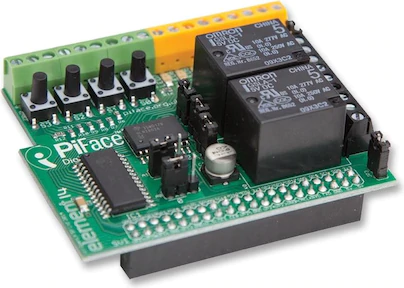

# PiFace

Le PiFace est un hat 26 broches qui propose des entrées/sortie à travers le SPI. Dans le cadre de ce projet, une carte relai I2C est un meilleur choix mais j'avais cette carte en stock, on fera donc avec.
Elle servira de carte relai 5V sans apport externe d'alimentation, donc plutôt réservé à des composants peu consommateur en ressource ou utilisés pour une courte période comme par exemple les moteur d'apport de nutriments.

## Installation 

git clone https://github.com/piface/pifacedigitalio
cd pifacedigitalio
sudo python3 setup.py install

