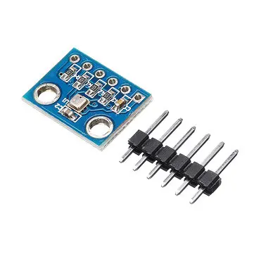

# Capteurs

| Capteur  | Temperature | Pression | Humidité | Altitude |
|----------|-------------|----------|----------|----------|
| BME280   |             |          |     X    |          |
| BMP280   |      X      |    X     |          |    X     |

## PCF8591: Convertisseur Analogique-Digital

Attention! Ce convertisseur est en 8 bits, pour une meilleure précision, il faudrait plutôt partir sur un MCP3008.

[Fiche technique](https://www.banggood.com/PCF8591-ADDA-Analog-Digital-Analog-Converter-Module-Measure-Light-and-Temperature-Produce-Various-Waveforms-p-1577996.html?rmmds=myorder&cur_warehouse=CN)

### Entrées

| Capteur       | Adresse |
| ------------- | ------- |
| libre         | 40      |
| Potentiomètre | 41      |
| Lumière       | 42      |
| Température   | 43      |
  
### Sorties
## BME280: Température, humidité et pression

[Fiche technique](https://www.banggood.com/BME280-Digital-Sensor-Temperature-Humidity-Atmospheric-Pressure-Sensor-Module-p-1354769.html?rmmds=myorder&cur_warehouse=CN)

